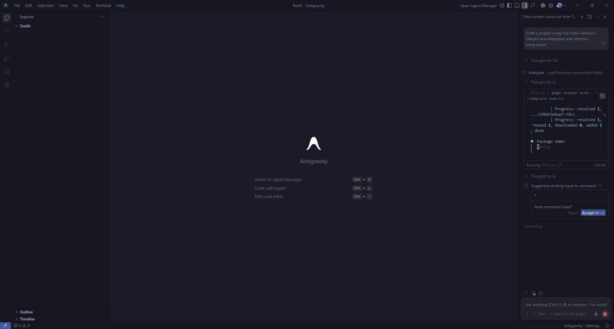
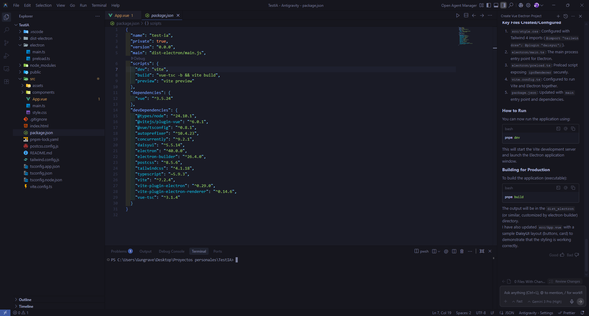

# 🏆 Milestone: Company Policies

---
### Research & Learn

#### What AI tools are typically used for your role?
- Code assistants like chatgpt and gemini to generate code or help with error resolution, vscode has an AI integration that can easily read files in the code for error resolution.

#### What are the benefits and riks of using AI in a professional setting?
- ##### Benefits
    - Time saving
    - Fast learning
    - Code refactorization
    - Best maintainability

- ##### Risks
    - Incorrect code
    - Outdated APIs or documantation
    - Legal riks (Copyright)
    - Just copy without understanding

#### What types of information should never be entered into AI tools?
- Gen keys for secrets like API secret
- Passwords and tokens
- Personal location, real name and professional mail accounts
- Banks accounts

#### How can you fact-check and validate AI-generated content to ensure accuracy?
Perform an internet search using sites with official documentation or not automatically generated by AI; in other cases, search on old sites before 2019 when it was not as important.

---
### Reflection

#### When should you use AI for assistance, and when should you rely on your own skills?
Only when you are completely stuck on a problem and want a solution or help is it recommended to ask for AI assistance, but if it is not a big problem and you believe you can solve it and learn the process, you should use your own skills.

#### How can you avoid over-reliance on AI while still benefiting from it?
You can try using it for things you really have no idea how to do, then check the code and try to reuse it in other applications to avoid posing the same problem to AI. And that way you can learn from the code itself.

#### What steps will you take to ensure data privacy when using AI tools?
- Use trusted AI tools 
- Dont share personal information
- If you have AI built into your IDLE, make sure you know which files you're sharing.
---
### Task

#### Identify one task you can improve using an AI tool, and try it out.
- Code using Antigravity (VS Code fork by Google)
- Ask the AI to perform a task and create or modify files in the project

#### Review the AI-generated output critically—did it require editing or fact-checking?
- Each command suggested by the AI requires manual approval (this can be optional)
- The AI needed my intervention because it created a project using an outdated Tailwind version for Vite, which required upgrading to the latest version
- The Electron configuration was incorrect and caused the project to fail
- The AI is best used for editing single files rather than creating or modifying many files at once, as some of its information is outdated

#### Document one best practice you will follow when using AI tools at Focus Bear.
Learn to make modifications on my own and only use AI for bug fixes or refactoring.

---
### Tests

