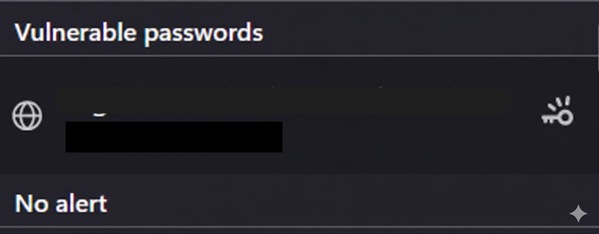

# 🏆 Cyber-Security-Guidelines
---

### 🔍 Research & Learn

####  What are common cyber security threats in a remote work environment?
- Phishing
- Social engineering
- Account theft

#### What are best practices for keeping your devices and accounts secure?
- Enable two-factor authentication (2FA)
- Use strong and unique passwords for each website (do not reuse passwords)
- Avoid using public Wi-Fi for work-related tasks
- Never leave your devices unattended and always protect them with a password
- Use a trusted antivirus solution

#### Why is it important to lock your computer when away from your desktop?
Locking your computer is important because even at home someone could accidentally interact with your system and cause errors. In public places, an unattended computer can allow unauthorized access to personal or professional information, such as work email or contacts.

#### How should you handle phishing attempts and suspicious links?
- Do not open links unless you can confirm they are legitimate
- Verify that the message comes from a service you are already subscribed to
- Double-check the sender’s email address and the website domain
- If you are unsure, avoid clicking the link altogether

#### What makes a strong password, and why should you use a password manager?
- Be longer than 10 characters
- Include a mix of symbols, numbers, uppercase and lowercase letters
- Be unique for each service

Using a password manager is important because it is very difficult to create and remember strong, unique passwords for every service. A password manager securely stores passwords and can synchronize them across devices such as your PC and mobile phone.

#### Why is two-factor authentication (2FA) important, and when should you enable it?
Two-factor authentication adds an extra layer of security by requiring a second verification step, such as a time-based code. Even if someone obtains your email and password, they cannot access your account without this code.

2FA should be enabled on:
- Professional and work-related accounts
- Accounts containig personal information (Photos, Documents)
- Financial or payments-related accounts

---
### Reflection

#### What security measures do you currently follow, and where can you improve?
I already use two-factor authentication (2FA), but not on all accounts that support it.
I use a unique, auto-generated password for each website, with a length of more than 10 characters. For my Gmail accounts, I use passwords longer than 60 characters.

I can improve by enabling 2FA on every account where it is available.

#### How can you make secure behaviour a habit rather than an afterthought?
I make security a habit by generating a strong password every time I create a new account and saving it immediately in my password manager. This approach is much better than reacting only after receiving a warning or discovering that someone has accessed my account. Following secure practices consistently can prevent problems long before they happen.

#### What steps will you take to ensure your passwords and accounts are secure?
- Generate passwords longer than 10 characters
- Use a password manager to store unique passwords
- Enable 2FA whenever the service provides the option

#### What would you do if you suspected a security breach or suspicious activity on your account?
I would immediately change my password and review recent login activity. I would also check my PC and mobile devices for malware or viruses that could be compromising my credentials.

---
### Task

#### Ensure your work accounts have strong passwords and enable 2FA where possible.
#### Review your password storage method—if you’re not using a password manager, consider setting one up.
#### Set up your computer and phone to automatically lock (require a password or biometric login) if you are away for more than a few minutes
#### Document one new cyber security habit you will follow at Focus Bear.

I have updated all my passwords associated with my Firefox account and ensured they are unique and strong. I currently have only one application with a vulnerable account where changing the password is not possible, and I will avoid using it for sensitive or work-related activities.

