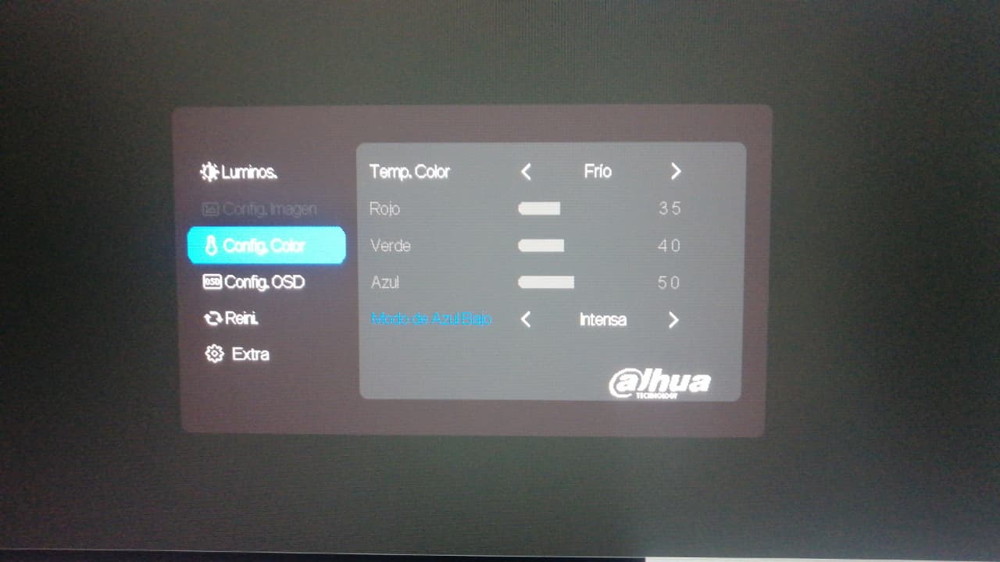

## 🔍 Research & Learn
---

#### What are the risks of using a laptop without an external monitor or keyboard?
* Neck and back pain from bending over to view the screen
* Wrist and hand injuries from poor posture

#### What ergonomic equipment can improve posture when working on a laptop? (e.g., laptop stands, external keyboards, ergonomic chairs)
* Laptop stands: raise the screen to the correct height
* External keyboard: type with arms at a distance
* External mouse: reduces wrist strain
* External monitor: reduces neck pain by minimizing head movement

#### What adjustments should be made to monitor height, chair position, and desk setup for a healthier workspace?
* Monitor: Screen at eye level
* Chair: Back straight, feet flat on the floor
* Desk: Keyboard and mouse at the same level

#### What are some daily habits that reduce the impact of prolonged laptop use? (e.g., movement breaks, posture checks, eye strain reduction techniques)
* Take breaks to move around or stretch
* Check your posture
* Adjust the screen brightness

## 📝 Reflection
---
#### What equipment changes can you make to improve your workspace setup?
* Switch to an office chair
* Use a laptop stand

#### What behavioural changes can you implement to improve posture and reduce strain? 
* Sit up straight
* Stand up to stretch

#### How can you remind yourself to maintain good posture and take breaks throughout the day? 
* With an app that helps with reminders

## 🛠 Task
---
#### Adjust your laptop setup based on ergonomic best practices.
I've already used an external monitor and an external mouse

#### Identify at least one piece of equipment that could improve your posture and comfort.
The external monitor helps me avoid having to look down all the time

#### Try using posture and movement reminders for a full workday and note any improvements. 
I already use an app to help me remember

#### Document at least one workspace change or habit adjustment you made.
I started using my computer's blue light mode to help my eyesight

