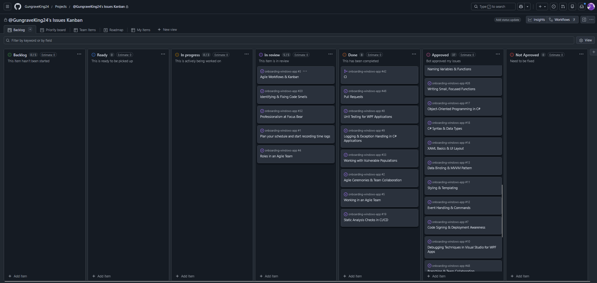

## 🔍 Research & Learn
---
#### How does a Kanban board work, and how does it help manage workflow?
A Kanban board visualizes work as tasks moving through defined stages. It helps manage workflow by making progress visible, identifying bottlenecks, and ensuring work is completed step by step instead of all at once.

---

#### What do the different columns on a Kanban board represent? (e.g., Backlog, In Progress, Blocked, Done)
- **Backlog**: Tasks that are planned but not yet started.
- **Ready**: Tasks that are ready to be picked up.
- **In Progress**: Tasks currently being worked on.
- **In Review**: Tasks waiting for review or automated checks.
- **Done / Approved**: Tasks that have been completed and approved.
- **Not Approved**: Tasks that need fixes after review.

---

#### How do tasks move through the board, and who is responsible for updating them?
Tasks move from left to right as work progresses. The person responsible for the task updates its status to reflect its current stage, ensuring the board stays accurate and useful for the team.

---

#### What are the benefits of limiting work in progress (WIP)?
- Helps the team focus on finishing tasks
- Avoids overload and context switching
- Improves overall quality and delivery speed

---
## 📝 Reflection
---
#### How does Kanban help manage priorities and avoid overload?
Kanban limits the number of tasks in progress, which encourages finishing work before starting new tasks. This helps avoid overload and makes priorities clearer because only a few items are actively worked on at a time.

In my case, seeing tasks visually grouped by status helps me decide what to work on next and prevents me from starting too many things simultaneously.

---

#### How can you improve your workflow using Kanban principles?
I can improve my workflow by keeping tasks small and updating their status immediately after any change. This keeps the board accurate and helps me track progress more clearly.

---
## 🛠 Task
---
#### Create a Kanban board for your repo with relevant columns (e.g. not started, in progress, ready for review, approved by bot)
I created a Kanban board using **GitHub Projects** for my repository.  
The board includes columns such as **Backlog**, **Ready**, **In Progress**, **In Review**, **Done**, **Approved**, and **Not Approved**.

Kanban board link:  
https://github.com/users/GungraveKing24/projects/2

---

#### Move at least one task through the Kanban process and update its status correctly
As shown in the board, I moved tasks related to onboarding (e.g. *Agile Workflows & Kanban* and *Pull Requests*) through multiple stages:
- From **Backlog** → **In Progress**
- Then to **In Review**
- Finally to **Done** or **Approved** once the bot accepted them

This demonstrates active use of the Kanban workflow rather than a static board.

---

#### Identify one way you can improve task tracking in your role
I can improve task tracking by updating task status immediately after changes and consistently moving tasks to **In Review** or **Not Approved** when feedback is received. This ensures the board always reflects the real state of my work.

Evidence:
