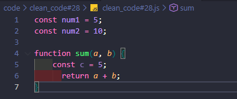
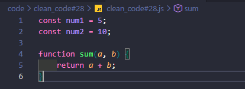

#### Why is code formatting important?
It helps improve readability and maintain consistency across the project. It also helps other developers on the team understand the code more quickly without discrepancies between files.

#### What issues did the linter detect?

* Unused variables
* Inconsistent indentation
* Incorrect use of comparisons

#### Did formatting the code make it easier to read?
It definitely makes it easier to understand and looks more organized.

---
### Pre fix

### After fix

