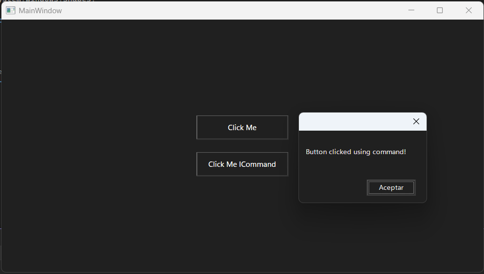

## 🔍 Research & Learn
---
#### How does WPF handle events, and what are the differences between routed events and standard events?
WPF manages events through an embedded system, unlike the (CLR) this allows events to be routed through the element tree and invoke controllers in multiple listeners, not just the element that originated the event.

Routed events enable
* Centralized handling
* UI behaviors without tight coupling
* Powerful composition

#### What are commands in WPF, and how do they integrate with the MVVM pattern?
A command is a intent not a action, for example
Instead of saying:
    ```"When you click the button, run this method"```
You say:
    ```"This button triggers this command"```
Commands are:
* Declarative
* Bindable
* Testeable
* MVVM-friendly

#### How does the ICommand interface facilitate the binding of commands to UI elements?
Using Command, your code can be tested. Since the logic resides in the C# plane (ViewModel) and not in a specific window or page, you can write unit tests to verify it.

```csharp
public interface ICommand
{
    bool CanExecute(object parameter);
    void Execute(object parameter);
    event EventHandler CanExecuteChanged;
}
```
Why this matters
* ```Execute``` → what the command does
* ```CanExecute``` → whether the button is enabled
* ```CanExecuteChanged``` → updates UI automatically

## 📝 Reflection
---
#### How does using commands improve the maintainability of your code compared to direct event handling?
Event triggers are activated directly, while commands represent the user's intentions.

#### Reflect on scenarios where commands are more beneficial than event handlers.
Separate user concerns by facilitating testing and improving UI state management.

#### What challenges might you encounter when implementing commands in WPF?
Initial security and debugging can be difficult.

## 🛠️ Task
---
#### Create a simple WPF example demonstrating a button click handled via a standard event.
#### Refactor the example to use a command and compare both approaches.

Code for these two anwser:

```csharp
// Mainwindow.xaml
<Window x:Class="EventCommandWPF.MainWindow"
        xmlns="http://schemas.microsoft.com/winfx/2006/xaml/presentation"
        xmlns:x="http://schemas.microsoft.com/winfx/2006/xaml"
        xmlns:d="http://schemas.microsoft.com/expression/blend/2008"
        xmlns:mc="http://schemas.openxmlformats.org/markup-compatibility/2006"
        xmlns:local="clr-namespace:EventCommandWPF"
        mc:Ignorable="d"
        Title="MainWindow" Height="450" Width="800">
    <Grid>
        <StackPanel HorizontalAlignment="Center" VerticalAlignment="Center" Margin="0,10,0,10">
            <Button Content="Click Me" Width="150" Height="40" Click="Button_Click" Margin="0,10,0,10"></Button>
            <Button Content="Click Me ICommand" Width="150" Height="40" Command="{Binding ClickCommand}" Margin="0,10,0,10"></Button>
        </StackPanel>
    </Grid>
</Window>

// MainWindow.cs
using Microsoft.VisualBasic;
using System;
using System.Text;
using System.Windows;
using System.Windows.Controls;
using System.Windows.Data;
using System.Windows.Documents;
using System.Windows.Input;
using System.Windows.Media;
using System.Windows.Media.Imaging;
using System.Windows.Navigation;
using System.Windows.Shapes;

namespace EventCommandWPF
{
    /// <summary>
    /// Interaction logic for MainWindow.xaml
    /// </summary>
    public partial class MainWindow : Window
    {
        public MainWindow()
        {
            InitializeComponent();

            // ICommand
            DataContext = new MainViewModel();
        }

        // Normal binding
        private void Button_Click(object sender, RoutedEventArgs e)
        {
            MessageBox.Show("Button example pressed", "Info");
        }

        //✅ Pros
        //    Simple
        //    Easy to understand

        //❌ Cons
        //    UI logic in code-behind
        //    Harder to test
        //    Poor MVVM compatibility
    }
}

// ICommand
// MainViewModel.cs
using System;
using System.Collections.Generic;
using System.Text;
using System.Windows;
using System.Windows.Input;

namespace EventCommandWPF
{
    internal class MainViewModel
    {
        public ICommand ClickCommand { get; }
        public MainViewModel()
        {
            ClickCommand = new RelayCommand(OnClick);
        }

        public void OnClick()
        {
            MessageBox.Show("Button clicked using command!");
        }
    }
}

// ICommand
// RelayCommand.cs
using System.Windows.Input;

public class RelayCommand : ICommand
{
    private readonly Action _execute;
    private readonly Func<bool> _canExecute;

    public RelayCommand(Action execute, Func<bool> canExecute = null)
    {
        _execute = execute;
        _canExecute = canExecute;
    }

    public bool CanExecute(object parameter) =>
        _canExecute == null || _canExecute();

    public void Execute(object parameter) =>
        _execute();

    public event EventHandler CanExecuteChanged
    {
        add => CommandManager.RequerySuggested += value;
        remove => CommandManager.RequerySuggested -= value;
    }
}
```

