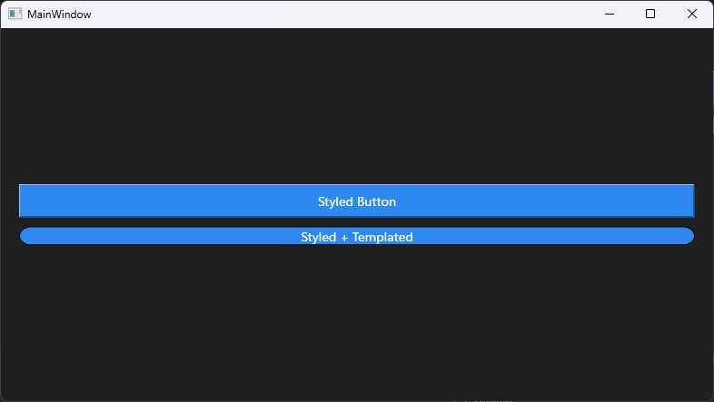

## 🔍 Research & Learn
---
#### What are the differences between styling and templating in WPF?
- Styling change appearance-related to properties, and templating the entire visual structure.
- Styling change color, fonts, margins and border. Templating change layout, visuals, animations, control composition.
- Example styling change backgrounds, fontsize and padding. Templating repace a button with custom shapes.

#### How do you define and apply styles and control templates?
* ##### Style:
```csharp
// Create a style
<Style x:Key="PrimaryButtonStyle" TargetType="Button">
    <Setter Property="Background" Value="#007ACC"/>
    <Setter Property="Foreground" Value="White"/>
    <Setter Property="FontSize" Value="14"/>
    <Setter Property="Padding" Value="10,5"/>
</Style>

// Apply the style 
<Button Content="Click Me" Style="{StaticResource PrimaryButtonStyle}" />
```
* ##### Templates:
```csharp
// Template completly redefines how a control is renderes
<ControlTemplate x:Key="RoundedButtonTemplate" TargetType="Button">
    <Border
        Background="{TemplateBinding Background}"
        CornerRadius="10"
        Padding="{TemplateBinding Padding}">
        <ContentPresenter
            HorizontalAlignment="Center"
            VerticalAlignment="Center"/>
    </Border>
</ControlTemplate>

// Apply the templa to change this button completly
<Button Content="Rounded" Background="DarkSlateBlue" Template="{StaticResource RoundedButtonTemplate}" />
```

#### What are best practices for designing reusable and adaptive UI elements?
* Use styles first 
* Centralized styles in Resource Dictionaries 
* Use TemplateBinding for better performance instead of of Binding 
* Separate layout from logic (MVVM-friendly)


## 📝 Reflection
---
#### How can using styles enforce consistency across your application?
By ensuring certain interface elements maintain a consistent style, every change would be applied to all components that use it. This avoids the need to modify each component individually to achieve consistency. For example, an error button and a complete button could always be used and maintain their style across more than 10 different interfaces.

#### Reflect on the benefits and challenges of using control templates.
* Benefits:
    * Visual freedom
    * Adaptability to any design
    * Variety of designs
* Challenges:
    * Steep learning curve
    * Easy to break control behavior
    * Very difficult to debug

#### How might templating improve the maintainability of your UI?
* Changes don't affect the logic
* Change the design without having to start from scratch
* Makes maintaining the interface easier

## 🛠️ Task
Example:
App code in: Root/code/WpfStylingDemo
---
```csharp
// App.xaml

<Application x:Class="WpfStylingDemo.App"
             xmlns="http://schemas.microsoft.com/winfx/2006/xaml/presentation"
             xmlns:x="http://schemas.microsoft.com/winfx/2006/xaml"
             xmlns:local="clr-namespace:WpfStylingDemo"
             StartupUri="MainWindow.xaml">
    <Application.Resources>
        <!-- Global Button Style -->
        <Style x:Key="PrimaryButtonStyle" TargetType="Button">
            <Setter Property="Background" Value="#2D89EF"/>
            <Setter Property="Foreground" Value="White"/>
            <Setter Property="FontSize" Value="14"/>
            <Setter Property="Padding" Value="12,6"/>
        </Style>

        <!-- Custom Control Template -->
        <ControlTemplate x:Key="RoundedButtonTemplate" TargetType="Button">
            <Border
            Background="{TemplateBinding Background}"
            CornerRadius="12"
            BorderBrush="Black"
            BorderThickness="1">
                <ContentPresenter
                HorizontalAlignment="Center"
                VerticalAlignment="Center"/>
            </Border>
        </ControlTemplate>
    </Application.Resources>
</Application>

// MainWindow.xaml
<Window x:Class="WpfStylingDemo.MainWindow"
        xmlns="http://schemas.microsoft.com/winfx/2006/xaml/presentation"
        xmlns:x="http://schemas.microsoft.com/winfx/2006/xaml"
        xmlns:d="http://schemas.microsoft.com/expression/blend/2008"
        xmlns:mc="http://schemas.openxmlformats.org/markup-compatibility/2006"
        xmlns:local="clr-namespace:WpfStylingDemo"
        mc:Ignorable="d"
        Title="MainWindow" Height="450" Width="800">
    <Grid>
        <StackPanel Margin="20" VerticalAlignment="Center">
            <Button Content="Styled Button"
            Style="{StaticResource PrimaryButtonStyle}"
            Margin="0,0,0,10"/>

            <Button Content="Styled + Templated"
            Style="{StaticResource PrimaryButtonStyle}"
            Template="{StaticResource RoundedButtonTemplate}"/>
        </StackPanel>
    </Grid>
</Window>
```

Evidence:
