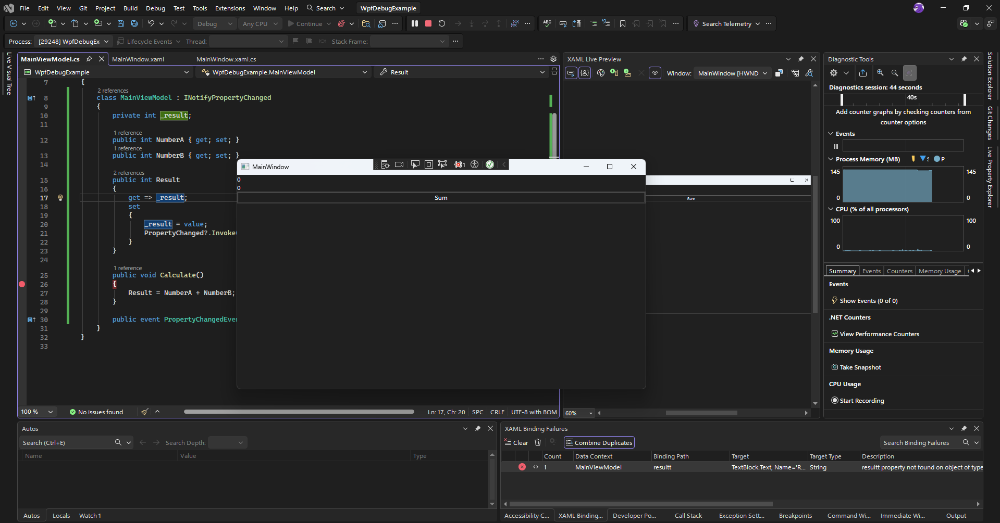
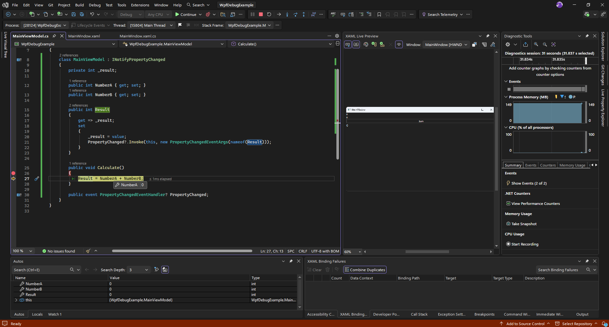

## 🔍 Research & Learn
---
#### What are the key debugging features in Visual Studio (e.g., breakpoints, watch windows, immediate window, etc.)?
* Breakpoint: Pauses execution at a specific point
* Watch/Automatic/Local: View variable values ​​in real time
* Immediate Window: Executes code while paused
* Call Stack: See how the application reaches that part of the code
* Exception Setting: Stops execution when an exception is encountered

#### How can you use these tools to inspect application state and monitor variable changes during runtime?
* Place breakpoint in important parts of the code
* Use watch to analize if the app is taking the correct type of data
* Advance line by line using `Step Over` and `Step Into`

#### What are some best practices for debugging WPF-specific issues, such as data binding errors or UI thread problems?
* Check `Output Window` to avoid data binding errors
* Verify `DataContext`
* Use `Dispatcher` for UI thread problems
* Avoid use heavy logic in the code-behind

## 📝 Reflection
---
#### Which debugging tools in Visual Studio do you find most useful and why?
* Breakpoints + Watch → quick and direct.
* Output Window → key for WPF binding errors.

#### Reflect on a scenario where a specific debugging feature helped you identify and resolve an issue.
A binding failed because the DataContext was incorrect.
The error appeared in Output and was confirmed with Watch.

#### How might improving your debugging skills impact your overall productivity?
* Less time searching for errors
* Better comprehension of the program flow

## 🛠️ Task
---
#### Create a simple WPF application with a deliberate bug, then use Visual Studio's debugging tools to identify and fix the issue.    

Complete Example in: Root/code/WpfDebugExample

```csharp
//MainViewModel.cs
using System;
using System.Collections.Generic;
using System.Text;
using System.ComponentModel;

namespace WpfDebugExample
{
    class MainViewModel : INotifyPropertyChanged
    {
        private int _result;

        public int NumberA { get; set; }
        public int NumberB { get; set; }

        public int Result
        {
            get => _result;
            set
            { 
                _result = value;
                PropertyChanged?.Invoke(this, new PropertyChangedEventArgs(nameof(Result)));
            }
        }

        public void Calculate()
        {
            Result = NumberA + NumberB;
        }

        public event PropertyChangedEventHandler? PropertyChanged;
    }
}

//MainWindow.xaml
// ResultTextBlock correct with [Binding Result], change to [Binding resultt] for the binding error 
<Window x:Class="WpfDebugExample.MainWindow"
        xmlns="http://schemas.microsoft.com/winfx/2006/xaml/presentation"
        xmlns:x="http://schemas.microsoft.com/winfx/2006/xaml"
        xmlns:d="http://schemas.microsoft.com/expression/blend/2008"
        xmlns:mc="http://schemas.openxmlformats.org/markup-compatibility/2006"
        xmlns:local="clr-namespace:WpfDebugExample"
        mc:Ignorable="d"
        Title="MainWindow" Height="450" Width="800">
    <StackPanel>
        <TextBlock Text="{Binding NumberA}"/>
        <TextBlock Text="{Binding NumberB}"/>
        <Button Content="Sum" Click="Button_Click" />
        <TextBlock x:Name="ResultTextBlock" Text="{Binding Result}" FontSize="16"/>
    </StackPanel>
</Window>

//Mainwindow.xaml.cs
using System.Text;
using System.Windows;
using System.Windows.Controls;
using System.Windows.Data;
using System.Windows.Documents;
using System.Windows.Input;
using System.Windows.Media;
using System.Windows.Media.Imaging;
using System.Windows.Navigation;
using System.Windows.Shapes;

namespace WpfDebugExample
{
    /// <summary>
    /// Interaction logic for MainWindow.xaml
    /// </summary>
    public partial class MainWindow : Window
    {
        MainViewModel vm = new MainViewModel();
        public MainWindow()
        {
            InitializeComponent();
            DataContext = vm;
        }

        private void Button_Click(object sender, RoutedEventArgs e)
        {
            vm.Calculate();
        }
    }
}
```

Firts error: Error of binding, resultt instead of Result


Now fixed and analized with the breakpoint
