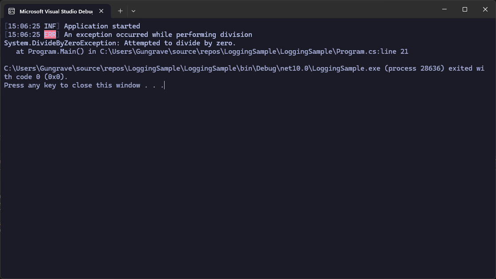
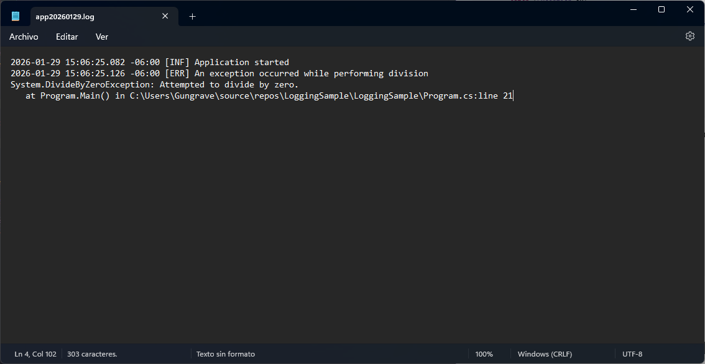

## 🔍 Research & Learn
---
#### What are the best practices for logging in C# applications (e.g., using frameworks like NLog or Serilog)?
* Use frameworks like `Serilog` or `NLog` (no `Console.WriteLine`)
* Structure logging with properties, no just text
* Correct levels:
    * `Debug` - Development
    * `Information` - Normal flow
    * `Warning` - Something weird but controlable
    * 'Error/Fatal' - Worts fails
* Never log sensible data (Passwords, tokens)

#### How should exceptions be handled and logged to capture meaningful diagnostic information?
* Exceptions are never caught and are simply ignored.
* Logger:
    * Message
    * Stack trace
    * Context (what the application was doing).
* Use try/catch to handle the error.

#### What are common patterns for error handling in production-level code?
* Global Expectation Manager
* Fast Fail (Fails quickly if something is invalid)
* Intuitive user message with technical details in the logs
* Centralizes logs (files, console, external service with API, or others)

📝 Reflection
---
#### How does effective logging contribute to faster troubleshooting and improved code quality?
It accelerates debugging, allowing developers to identify errors in production and improving code quality in the long run.

#### Reflect on the impact of exception handling on application stability and user trust.
Proper management of these factors creates a more stable application, while improper management or failure to manage them creates more problems such as crashes, data loss, and a generally bad reputation.

#### What strategies would you adopt to enhance logging in a complex application?
* Structure logging
* Correlation IDs
* Separate technical logs from user messages 

🛠️ Task
---
#### Integrate a logging framework (e.g., NLog or Serilog) into a sample C# project.
#### Implement structured exception handling that logs errors with sufficient detail.

Basic example using Serilog:
```csharp
using System;
using Serilog;

class Program
{
    static void Main()
    {
        Log.Logger = new LoggerConfiguration()
            .MinimumLevel.Debug()
            .WriteTo.Console()
            .WriteTo.File("logs/app.log", rollingInterval: RollingInterval.Day)
            .CreateLogger();

        try
        {
            Log.Information("Application started");

            int x = 10;
            int y = 0;

            int result = x / y; // error intencional
        }
        catch (Exception ex)
        {
            Log.Error(ex, "An exception occurred while performing division");
        }
        finally
        {
            Log.CloseAndFlush();
        }
    }
}
```

Code in: Root/code/LoggingSample

## Evidence:

##### Running the app  


##### Checking the log in as a file generated [app20260129].txt 
