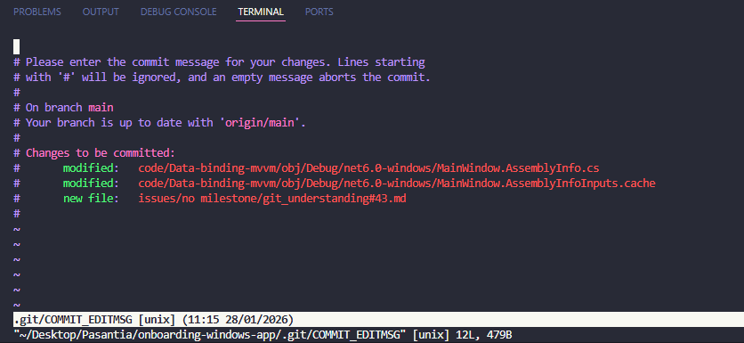
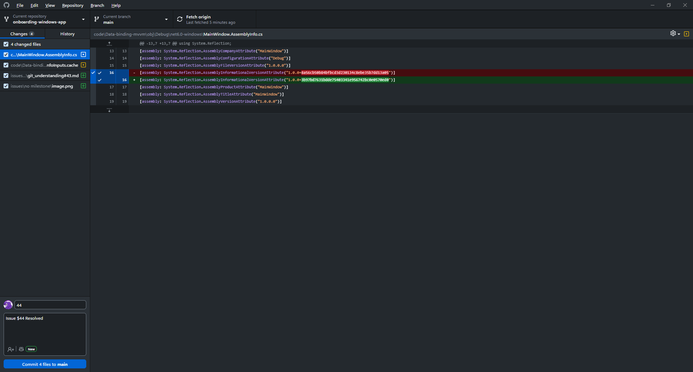
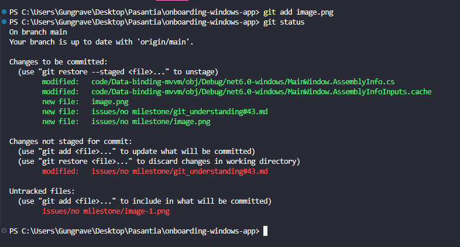
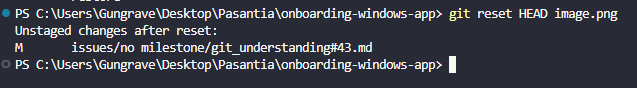

#### What is the difference between staging and committing?
**Staging** is used to preview the changes that will be included in the next commit. Files in staging are not yet saved to the repository history.

**Commit** fully saves the changes to the Git history, creating a reference point with a descriptive message of what was done for the commit.

#### Why does Git separate these two steps?
To give greater control over which changes are included in each commit, allowing for cleaner and more focused commits, even when multiple changes have been made to different files.

#### When would you want to stage changes without committing?
* To review changes before committing
* To prepare a commit while making other changes
* Before syncing with the main branch without losing work

