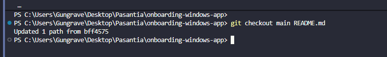

I change the README.md file in main branch and after that i came that change to test-ci branch

#### What does each command do?
* `git checkout main -- <file>`: Restores a specific file from the main branch without affecting local changes. Use this when a file you're working on breaks.
* `git cherry-pick <commit>`: Applies a specific commit from another branch to the current one. Use this when a branch has many changes but you only need one.
* `git log`: Shows the repository's commit history, allowing you to understand how the code has evolved and review past changes or when bugs were introduced.
* `git seek <file>`: Sees who modifies each line of code, allowing you to verify who worked on it and ask if there are any problems.

#### When would you use it in a real project (hint: these are all really important in long-term projects with multiple developers)?
When working on a group project with multiple developers, each with their own specific tasks, it's important to keep track of versions and changes made to the application.

#### What surprised you when you tried these commands?
Because of how useful they are for avoiding having to restart a project from scratch in case of a problem, thus saving time and being more efficient. Plus, you get great feedback by knowing who makes changes and where.