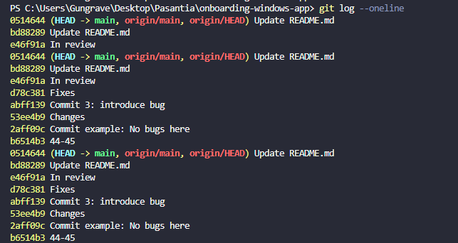

#### What does each command do?
* `git checkout main -- <file>`: I modified README.md in the test-ci branch and then restored it from main.
The file was reverted without affecting other local changes.
* `git cherry-pick <commit>`: I created a commit in another branch and cherry-picked only that commit
into main, avoiding merging unrelated changes.
* `git log`: I used git log to review the commit history and understand how the file
evolved over time.
* `git seek <file>`: I ran git blame on README.md to identify which commit and author last
modified each line.

#### When would you use these in a real project?
In long-running projects with multiple developers, these commands help
recover files, move specific fixes between branches, analyze history,
and understand ownership of code.

#### What surprised you?
I was surprised how precise these tools are, especially git cherry-pick
and git blame, which help isolate changes and responsibility quickly
without affecting the entire project.

EVIDENCE:

1- git checkout main -- <file>
I modified README.md in test-ci, then restored it from main using
git checkout main -- README.md. The file reverted without affecting
other local changes.

2- git cherry-pick
I created a commit in a feature branch and cherry-picked only that
commit into main instead of merging the entire branch.
 

3- git log
I used git log to inspect the commit history and identify when specific
changes were introduced.

4- git blame
I used git blame on README.md to see which commits and authors modified
each line of the file.
