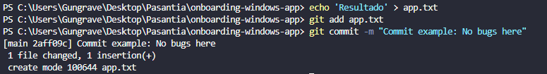

#### What does `git bisect` do?
Ayuda a encontrar exactamente que commit introdujo un bug, usando una busqueda binaria mas rapida que revisar uno a uno.

#### When would you use it in a real-world debugging situation?

#### How does it compare to manually reviewing commits?

Evidence:
##### Firts git status to see that is nothing to update

##### Adding a file without errors
