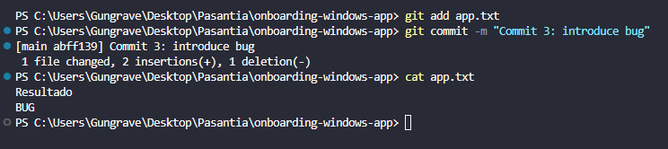
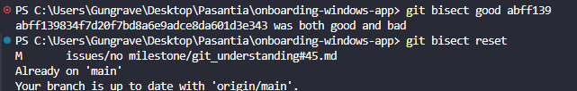

#### What does `git bisect` do?
It helps you find exactly which commit introduced a bug, using a binary search that's faster than checking each commit individually.

#### When would you use it in a real-world debugging situation?
When a bug appears and it's unclear which commit introduced it, especially in projects with many commits or multiple developers.

#### How does it compare to manually reviewing commits?
Git bisect is faster and more efficient. While manual review is linear, bisect reduces the number of tests exponentially.

---
## Evidence:
##### Firts git status to see that is nothing to update

##### Adding a file without errors

##### Mark it as correct

##### Here you can see the commit history to search by its binary

##### The final result of bisect
