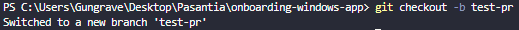
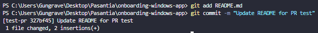
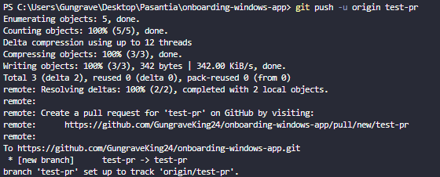
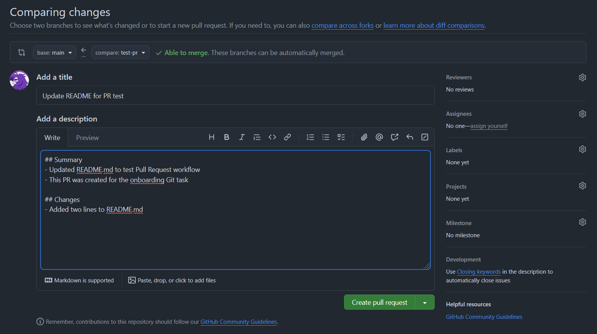
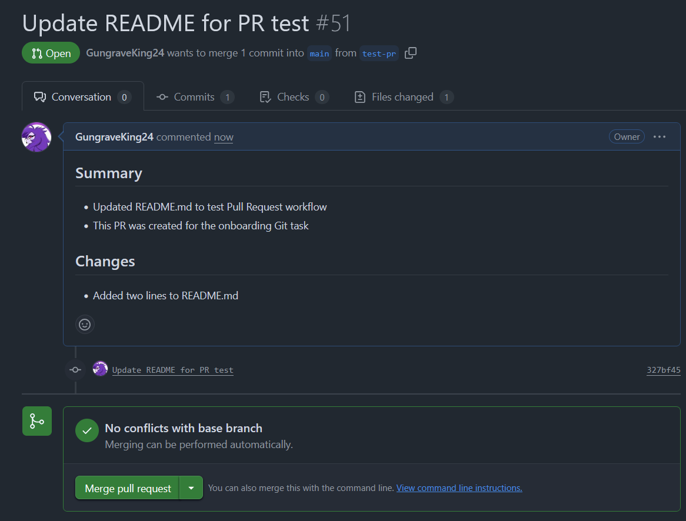

#### Why are PRs important in a team workflow?
Pull Requests are important because they allow changes to be reviewed before
being merged into the main branch.

In my case, I created a PR titled:
" Update README for PR test #51 "
which included a clear description of the changes made to the README.md file.
This helped ensure the changes were reviewed before being merged into main.

Evidence of the PR:

---

#### What makes a well-structured PR?
From my experience creating a PR, a well-structured PR:
- Has a clear and descriptive title
- Explains what was changed and why
- Is small and focused on a single task
- References related issues when applicable

This made my PR easier to review and merge.

---

#### What did you learn from reviewing an open-source PR?
I reviewed a Pull Request from the `onboarding-windows-app` fork repository:

While reviewing it, I observed:
- Reviewers requested specific changes to improve code readability
- Discussions focused on how the change could impact other parts of the project

This showed me how large projects carefully review changes before approving them.

---

#### PR Review and Merge Confirmation
My Pull Request was reviewed and successfully merged into the main branch.

Evidence of PR:
##### Branch created:

##### Creation of the modified commit: README.md file

##### Upload branch to github

##### Creacuib del PR

##### PR completed
